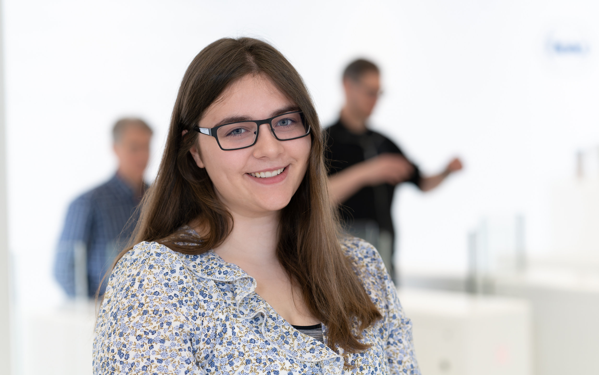

Mein Name ist Isabella Freitag. Ich bin in meinem letzten Lehrjahr als Informatikerin mit der Fachrichtung Betriebsinformatik. Ich mache meine Lehre bei der F. Hoffmann-La Roche AG in Basel.

Bisher habe ich die Werkschule absolviert, war eine kurze Zeit im Dev Team unserer Ausbildungsabteilung, war in einem Analytics und Reporting Team, bin dann für ein paar Monate ins Client Management gekommen und bin jetzt in einem Data und Analytics Team. Ausserdem unterstütze ich auch regelmässig die Berufsbildung in dem ich das Berufsschnuppern oder Informatikworkshops leite.

Im Laufe meiner Ausbildung bei der Roche durfte ich bis jetzt den Umgang mit verschiedenen Betriebssystemen, Programmiersprachen, Frameworks, Datenbanken, Virtualisierungs- und Orchestrierungsmöglichkeiten kennenlernen und anwenden.
Ich habe gerlent zu programmieren, zu scripten und zu deployen. 
Das Arbeiten im Team hat mir gezeigt, wie man Projektmanagement effektiv anwenden und praktizieren kann. Ausserdem habe ich gelernt wie wichtig CI/CD ist, um ein Team zu entlasten und dem Kunden gegenüber eine standartmässige Qualität gewährleisten zu können. 
Projekte bei denen ich den Lead hatte, durfte ich auch dem Management vorstellen und präsentieren. Entsprechende Projekte wurden angenommen und werden jetzt verwendet. 

Ich finde es spannend in jedem Sprint etwas neues zu lernen und immer wieder neue Möglichkeiten zur Lösung verschiedenster Probleme zu finden. 

Wenn Sie mehr über mich erfahren wollen, besuchen sie gerne mein [LinkedIn Profil](https://www.linkedin.com/in/isabella-freitag-2a6208289/)

## Meine Erfahrungen
- Client Betriebsysteme: Windows, Linux (Ubuntu, RedHat)
- Server Betriebsysteme: Windows und Linux
- Programmiersprachen: Java, Python, Apps Script, Java Script, Bash, R, Power Shell
- Frameworks: SpringBoot, Pandas, Streamlit, Bootstrap, Swing, Vaadin
- Datenbanken: MongoDB, MySQL, Neo4j, Snowflake, MariaDB
- Entwicklungsumgebungen: GitLab, GitHub, Visual Studio Code, Eclipse, IntelliJ, PyCharm
- Vitualisierung: Docker, VMWare (ESXi)
- Orchestrierung: Rancher, MiniCube
- Netzwerk-Kenntnisse: Netzwerkgrundlagen undServer Monitoring mit Nagios
- Working-Strategies: Scrum
- Andere Kenntnisse: git, CI/CD, yaml, Html, CSS, Tableau, Microsoft Office (ECDL Zertifikat), 3D Druck
- Sprachen: Deutsch (Muttersprache), Englisch (Business Englisch), Französisch, Spanisch

## Grosse Projekte während meiner Ausbildung
In diesem Unterkaptitel finden Sie alle Projektarbeiten, an denen ich während meiner Lehre mitwirken durfte oder den Lead hatte. Aus geheimhaltungsgründen, darf ich die entsprechenden Projekte hier nicht verlinken oder offenlegen, dennoch möchte ich aufzeigen, was ich während meiner Ausbildung gemacht habe. 

### Lehrjahr 1
- Greenroom (Lead):  Dokumentation des Setups eines Greenrooms für Foto- und Videoproduktionen
- Esportarea Basel:  Einrichten der PC-stations und Erstellen der Servicenow-Site für die Esportsarea in einem der Rochetürme in Basel
  
### Lehrjahr 2
- Automatisiertes Datensheet (Lead):  Mittels Apps Script wurden GMP Daten automatisiert in ein passendes Template eingefügt und in ein passendes Dokument umgewandelt.
- Client-Rollout in der Produktion: ca. 80 Clients wurden gestaged, getestet und dann in der Produktion ausgerollt. Ausserdem wurden Powershell-Scripts zur Automatisierung verwendet. 
- Probe IPA (Lead):  Kommentarfunktion von Tableau mittels Streamlit und Snowflake realisiert.
  
### Lehrjahr 3
- Workstation-Overview: Eine Applikation, die mittels der RedHat Satellite API, die Daten für alle Workstations darstellen kann. Die Applikation musste im Nachgang noch überarbeitet werden und in diesem Zusammenhang wurden zusätzliche Sicherheitsfeatures eingebaut. 
- Adminportal: Ein [Homer-Dashboard](https://github.com/bastienwirtz/homer), dass alle wichtigen Applikationen und Links anzeigt, die das Team benötigt
- Meshcommander (Lead): Eine openSource AMT Managementconsole wurde auf Rancher deployed. Dafür wurde mittels CI/CD ein Dockerimage erstellt, dass dann in die GitLab Registry geladen und dann mittel Rancher deployed wurde. Die Daten zu den Workstations werden automatisiert von der RedHat Satellite API gezogen und automatisiert in ein JSON umgewandelt, dass dann in den Local Storage von Meshcommander geladen werden kann. Um Sicherheit in diesem Zusammenhang gewährleisten zu können, wurde Vault verwendet.

## Arbeitsproben 
Die Arbeitsproben, die Sie hier finden können, sind privat oder zu Schulmodulen entstanden.
- [Streamlit Applikation um Python zu lernen](https://interactive-intro-to-python-j8zb4sq8qenebn9mm7duk6.streamlit.app/), entstanden 2024
- ...
- [Aufträge im eigenen Berufsumfeld durchführen](https://bella1712.github.io/Modul-431/), entstanden 2022 (in meinem ersten Lehrjahr)

